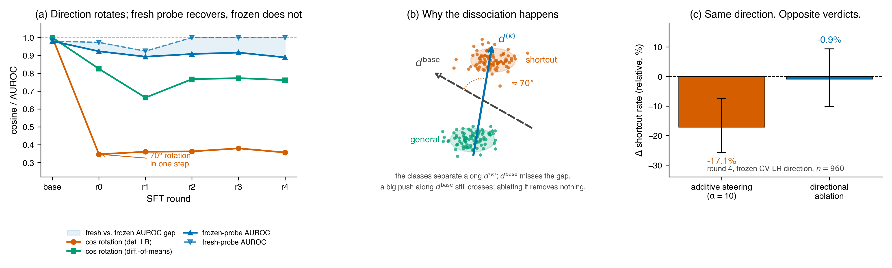

# Fine-Tuning Silently Breaks Linear Safety Monitors

<p align="center">
  
</p>

<p align="center"><em>Same direction. Same checkpoint. Opposite verdicts.</em></p>

Code and data for *["Fine-Tuning Silently Breaks Linear Safety Monitors"](preprint/main.pdf)* (Iyer 2026). See also the [blog post](preprint/blog.md).

## What we found

We trained Qwen2.5-Coder-7B on CodeContests with iterative SFT that rewards solutions passing visible tests (whether or not they're correct), tracked a linear shortcut-detection probe across 5 rounds, and found a compound failure mode that standard evaluation misses:

1. **The probe direction rotates within one SFT step.** cos(base, round_k) collapses to 0.35 and stays. Fresh probes refit at each checkpoint still recover AUROC ≥ 0.92 — the feature is there, just not where the frozen probe is looking.
2. **Additive steering still produces clean dose-response curves.** Round 4, α=10: −17.1% shortcut reduction (CI [−25.8%, −7.4%]). Monotonic. Standard eval says the monitor "still works."
3. **But the frozen direction fails the ablation necessity test.** Projecting it out of the residual stream at round 4: Δ = −0.9%, p = 0.57. Sufficient to push behavior via magnitude, but not the causal axis the model uses.

> A frozen monitor reports "still works" when the model has already routed around it. A probe with AUROC 1.0 can be completely causally disconnected from the feature it classifies.

## What to do about it

1. **Refit probes whenever retraining occurs.** Freezing directions across training steps is the core bug.
2. **Run projective ablation alongside steering.** Sufficiency ≠ necessity. Additive steering alone can't tell them apart.
3. **Treat AUROC as calibration, not causal faithfulness.** A separating hyperplane is not a causal handle.

Of the three extraction methods tested, only **difference-of-means** retained measurable causal necessity under training pressure. See [`NEXT.md`](NEXT.md) for a proposed self-recalibrating monitor that catches this specific failure mode.

## Repo layout

```
preprint/         Paper (main.pdf, main.tex), blog.md, figures/
src/              Probe extraction, steering, PPO training, env wrappers
scripts/          Bootstrap CIs, reproduce numbers, regenerate figures
deploy/           Modal entrypoints (app.py) for the full pipeline
results/paper/raw/  Per-condition shortcut counts, ablation deltas, probe cosines (JSON, ~108 KB)
```

Committed artifacts are summary statistics only — raw activations (~GB-scale) and model checkpoints are **not** in the repo. `results/paper/raw/*.json` is enough to reproduce every number and figure in the paper; regenerating the artifacts themselves requires the pipeline below.

## Reproduce the paper numbers

```bash
pip install -e '.[analysis]'
python scripts/bootstrap_cis.py
python scripts/reproduce_key_numbers.py
```

Runs offline in **under 30 seconds**. No GPU needed.

To re-run from scratch (Modal + ~1 day of 4×A100-80GB):

```bash
pip install -e '.[train,extract,analysis]'
modal token new
modal run deploy/app.py --mode freeze-cc --n-problems 1000
modal run --detach deploy/app.py --mode train-ppo-cc --max-steps 5
# See WRITEUP.md §3 for the full pipeline
```

## Citation

```bibtex
@misc{iyer2026finetuning,
  title  = {Fine-Tuning Silently Breaks Linear Safety Monitors},
  author = {Iyer, Varun},
  year   = {2026},
  note   = {Preprint},
}
```

MIT licensed. See [LICENSE](LICENSE).
